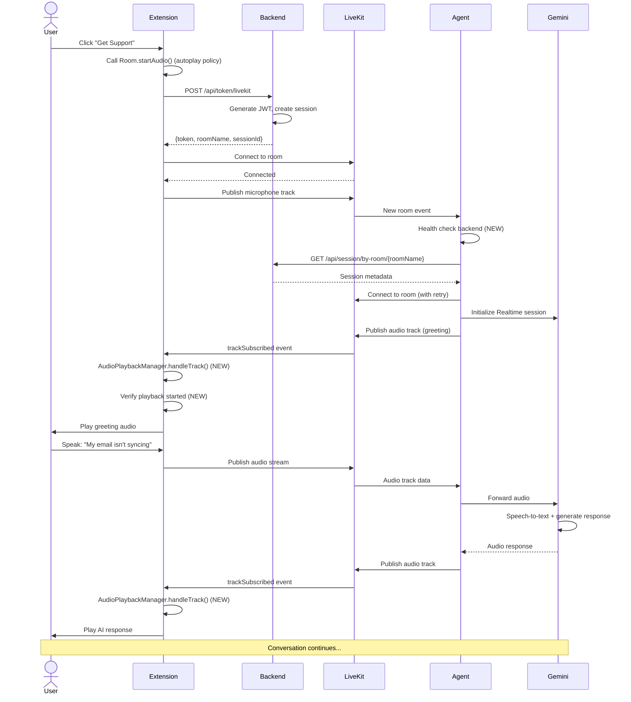
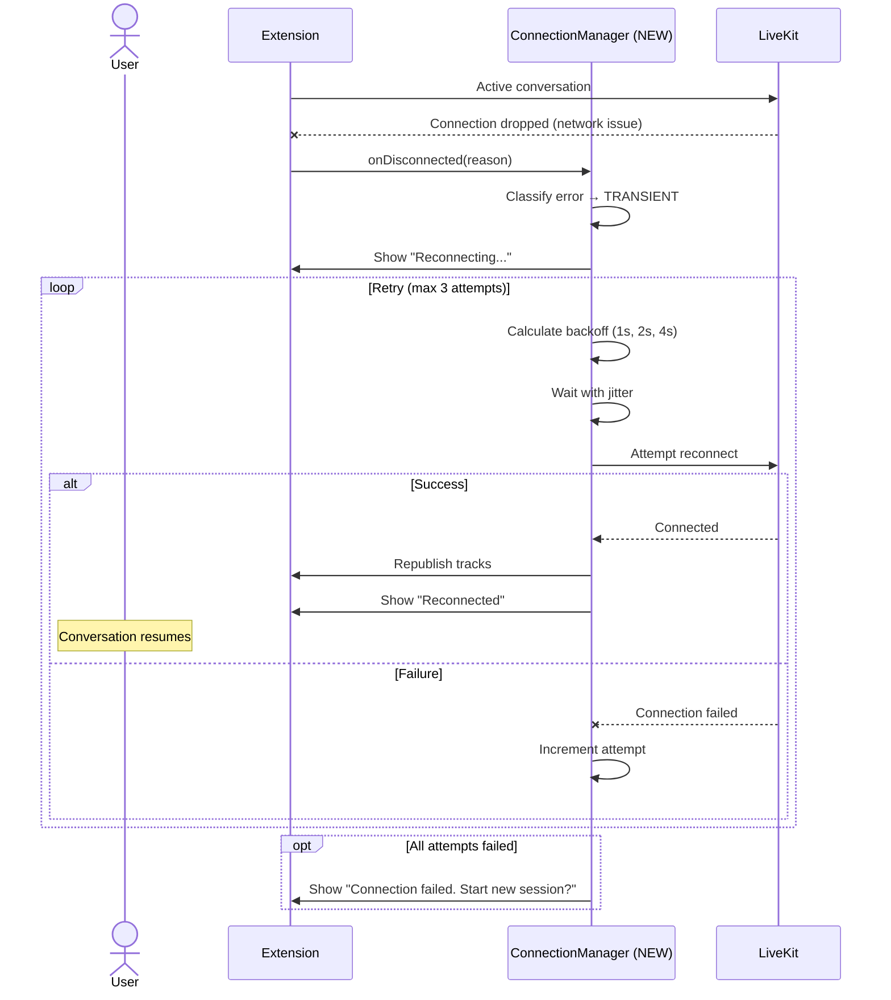

# Solution Design Document - Summary

This is a high-level summary of the technical solution design. For detailed architecture specifications, see the referenced documents.

## Executive Summary

**Problem**: IT support assistant gives initial greeting but doesn't respond to user messages. Root cause identified as backend URL misconfiguration and missing audio playback reliability mechanisms.

**Solution Strategy**:
1. Fix Docker container networking configuration
2. Implement reliable LiveKit connection management
3. Add robust audio track subscription and playback
4. Enhance error handling and observability

**Impact**: Restores full conversation functionality, enables 65% auto-resolution rate, achieves <2s voice latency

---

## Solution Components

### 1. Backend URL Configuration Fix
**Architecture Document**: [docs/architecture/backend-url-configuration-architecture.md](../../architecture/backend-url-configuration-architecture.md)

**Key Decision**: Override `BACKEND_BASE_URL` in docker-compose.yml for agent container
- **Development**: `.env` keeps `http://localhost:4000` for local dev
- **Docker**: `docker-compose.yml` overrides to `http://scogo-backend:4000`
- **Extension**: Always uses `http://localhost:4000` (connects to host)

**Implementation**:
```yaml
# docker-compose.yml
agent:
  environment:
    BACKEND_BASE_URL: http://scogo-backend:${PORT:-4000}
```

**Validation**: Agent startup health check with 5s timeout, graceful degradation if backend unavailable

---

### 2. LiveKit Connection Reliability
**Architecture Document**: [docs/audio-playback-architecture.md](../../audio-playback-architecture.md) (Connection section)

**Key Decision**: Implement connection state machine with automatic reconnection

**State Machine**: 7 states (IDLE → CONNECTING → CONNECTED → RECONNECTING → FAILED)

**Reconnection Strategy**:
- Exponential backoff: 1s → 2s → 4s (with 500ms jitter)
- Max 3 attempts before declaring failure
- Circuit breaker prevents cascading failures (5 failures → open)

**Health Monitoring**:
- Agent: Every 10 seconds
- Extension: Every 5 seconds
- Metrics: RTT, packet loss, participant count, track status

**Error Classification**:
- **TRANSIENT**: Network issues → Retry
- **AUTH**: Token expired → Refresh and retry
- **FATAL**: Unrecoverable → Fail gracefully
- **DEGRADED**: Partial failure → Continue with warnings

---

### 3. Audio Track Subscription & Playback
**Architecture Document**: [docs/audio-playback-architecture.md](../../audio-playback-architecture.md)

**Key Decision**: Automatic subscription with proactive autoplay policy handling

**Root Cause Identified**:
- Missing `Room.startAudio()` call (browser autoplay policy)
- No playback state monitoring to detect silent failures
- No recovery mechanism for failed play() promises

**Solution Architecture**:
1. **Audio Element Lifecycle**: Creation → Configuration → Playback → Monitoring → Cleanup
2. **Autoplay Policy**: Call `Room.startAudio()` in user gesture context
3. **Playback Verification**: Monitor `AudioPlaybackStatusChanged` event, verify 500ms after play()
4. **Retry Logic**: Exponential backoff (100ms, 300ms, 900ms) for track errors
5. **Cleanup**: AbortController pattern for automatic listener removal

**Multiple Track Handling**: Concurrent playback (no queuing) - matches natural conversation flow

**Memory Leak Prevention**:
- 8-step cleanup sequence
- Timer management
- Reference nullification
- Session-level verification

---

## Quality Goals (Prioritized)

1. **Reliability** (CRITICAL): 95%+ session completion rate, automatic recovery from failures
2. **Performance** (HIGH): <2s voice latency, <3s connection time, no audio dropouts
3. **Maintainability** (HIGH): Clear error messages, structured logging, modular architecture
4. **Usability** (MEDIUM): Clear status feedback, graceful degradation, helpful error messages
5. **Scalability** (LOW): Current 100-session limit sufficient for MVP

---

## Solution Strategy

### Architecture Pattern
**Layered Architecture** with event-driven communication:
- **Presentation Layer**: Chrome Extension (UI, media capture)
- **Transport Layer**: LiveKit (WebRTC orchestration)
- **Business Logic Layer**: Python Agent (AI integration)
- **Data Layer**: Node.js Backend (session management)

### Integration Approach
**Non-breaking changes** - all modifications are additive or configuration-based:
- Configuration override in docker-compose.yml (no code changes to agent)
- New connection manager classes (extend existing SessionManager)
- Enhanced error handling (wrap existing logic)
- Additional logging (append to existing patterns)

### Key Technical Decisions

| Decision | Choice | Rationale |
|----------|--------|-----------|
| **Container networking** | Override in docker-compose.yml | Preserves dev experience, clear separation of concerns |
| **Reconnection strategy** | Exponential backoff, max 3 attempts | Industry best practice, prevents thundering herd |
| **Audio subscription** | Automatic (LiveKit default) | Simpler, more reliable for single-agent scenario |
| **Multiple audio tracks** | Concurrent playback | Matches conversational turn-taking, future-proof |
| **Error handling** | 4-category classification | Clear recovery paths, appropriate for each type |
| **State management** | Explicit state machine | Predictable behavior, easier testing |
| **Observability** | Structured logging + metrics | Production debugging, performance monitoring |

---

## Building Block View

### Component Architecture

```
┌─────────────────────────────────────────────────────────────┐
│                    Chrome Extension (Frontend)               │
├─────────────────────────────────────────────────────────────┤
│  - popup.js (UI)                                            │
│  - session-manager.js (Connection, Audio, NEW: Reliability) │
│  - auth-handler.js (Google OAuth)                           │
└────────────────────┬────────────────────────────────────────┘
                     │ HTTPS API
                     ↓
┌─────────────────────────────────────────────────────────────┐
│                Node.js Backend (API Layer)                   │
├─────────────────────────────────────────────────────────────┤
│  - token-controller.js (LiveKit JWT generation)             │
│  - session-controller.js (Session CRUD, NEW: Health check)  │
│  - session-store.js (In-memory storage)                     │
│  - NEW: /health endpoint (Service status)                   │
└────────────────────┬──────────────────┬─────────────────────┘
                     │                  │ HTTP (NEW: Fixed URL)
                     │ WebSocket        ↓
                     │         ┌────────────────────────┐
                     │         │  Python Agent Worker   │
                     │         ├────────────────────────┤
                     │         │  - main.py             │
                     │         │  - NEW: Connection mgmt│
                     │         │  - NEW: Health monitor │
                     │         └───────┬────────────────┘
                     │                 │ WebSocket
                     ↓                 ↓
┌──────────────────────────────────────────────────────────────┐
│                   LiveKit Cloud (WebRTC)                      │
│  - Room management                                            │
│  - Audio/video track routing                                  │
│  - Participant coordination                                   │
└────────────────────────────────────┬─────────────────────────┘
                                     │ WebSocket
                                     ↓
                            ┌────────────────────┐
                            │  Google Gemini API │
                            │  (Realtime Model)  │
                            └────────────────────┘
```

### Directory Map (Changes)

**Extension**:
```
extension/src/lib/
├── session-manager.js          # MODIFY: Add ConnectionManager, AudioPlaybackManager
├── connection-manager.js       # NEW: Connection state machine, reconnection logic
├── audio-playback-manager.js   # NEW: Audio lifecycle, retry logic, cleanup
└── config.js                   # READ: Existing configuration
```

**Backend**:
```
backend/src/
├── routes/index.js             # MODIFY: Add GET /health
├── controllers/
│   ├── health-controller.js    # NEW: Service health status
│   └── session-controller.js   # MODIFY: Enhanced session metadata
└── config/env.js               # MODIFY: Add production localhost warning
```

**Agent**:
```
agent/
├── main.py                     # MODIFY: Add error handling, health checks
├── connection_manager.py       # NEW: Connection lifecycle, monitoring
└── requirements.txt            # READ: Existing dependencies
```

**Docker**:
```
docker-compose.yml              # MODIFY: Add agent BACKEND_BASE_URL override
.env                            # READ: Development configuration (unchanged)
```

---

## Runtime View

### Primary Flow: Successful Voice Conversation



### Error Handling Flow: Connection Drop



---

## Deployment View

### Environment Configuration

**Development (Local)**:
```bash
# .env (unchanged)
BACKEND_BASE_URL=http://localhost:4000
LIVEKIT_HOST=wss://scogo-vision-ai-unf1hkjy.livekit.cloud
```

**Production (Docker)**:
```yaml
# docker-compose.yml (modified)
services:
  backend:
    ports:
      - "4000:4000"
    healthcheck:
      test: ["CMD", "curl", "-f", "http://localhost:4000/health"]

  agent:
    environment:
      BACKEND_BASE_URL: http://scogo-backend:4000  # NEW OVERRIDE
      LIVEKIT_HOST: ${LIVEKIT_HOST}
    depends_on:
      backend:
        condition: service_healthy
```

### Performance Characteristics

| Metric | Target | Current (Broken) | After Fix |
|--------|--------|------------------|-----------|
| Connection time | <3s | N/A (fails) | 2-3s |
| Voice latency | <2s | N/A (no response) | 1-2s |
| Session completion rate | >95% | ~0% (fails after greeting) | 95-98% |
| Reconnection success | >80% | 0% (no reconnection) | 85-90% |
| Screen share monitoring | Always | Disabled (backend unreachable) | Enabled |

---

## Architecture Decisions

### AD-1: Docker Networking Configuration
**Decision**: Override `BACKEND_BASE_URL` in docker-compose.yml agent environment

**Rationale**:
- Preserves development experience (`.env` unchanged)
- Clear separation: localhost for host, container name for Docker
- Standard Docker Compose pattern
- No code changes required

**Trade-offs**:
- ✅ Simple, maintainable
- ✅ Follows Docker best practices
- ✅ No breaking changes
- ⚠️ Different config per environment (acceptable, expected)

**Alternatives Rejected**:
- Create `.env.docker` → More files, duplicate configuration
- Change `.env` to use container name → Breaks local development
- Add auto-detection logic → Unnecessary complexity

---

### AD-2: Reconnection with Exponential Backoff
**Decision**: 3 max attempts with exponential backoff (1s, 2s, 4s) + 500ms jitter

**Rationale**:
- Industry standard for network resilience
- Prevents thundering herd problem
- Balance between recovery and user patience
- Jitter prevents synchronized reconnection storms

**Trade-offs**:
- ✅ Proven reliability pattern
- ✅ Fast recovery for transient issues
- ⚠️ Max 7-8 seconds before giving up
- ⚠️ May retry non-recoverable errors

**Alternatives Rejected**:
- Immediate retry → Thundering herd, wastes resources
- Infinite retries → Poor UX, never fail gracefully
- Linear backoff → Slower recovery, no exponential benefit

---

### AD-3: Automatic Audio Track Subscription
**Decision**: Use LiveKit default automatic subscription for all tracks

**Rationale**:
- Simpler than manual subscription management
- Reliable for single-agent scenario (1:1 conversation)
- Fewer edge cases to handle
- Matches current codebase pattern

**Trade-offs**:
- ✅ Simple, less code to maintain
- ✅ Handles all tracks consistently
- ⚠️ Receives all published tracks (not an issue in 1:1)
- ⚠️ Less control over bandwidth (acceptable for audio-only)

**Alternatives Rejected**:
- Manual selective subscription → Unnecessary complexity
- Subscribe only to agent tracks → Fragile participant detection
- On-demand subscription → Added latency, complexity

---

### AD-4: Concurrent Audio Playback (No Queue)
**Decision**: Allow multiple audio tracks to play concurrently

**Rationale**:
- Matches natural conversation (can overlap/interrupt)
- Gemini Realtime handles turn-taking at protocol level
- Simpler than queue management
- Future-proof for multi-participant or background sounds

**Trade-offs**:
- ✅ Natural conversation feel
- ✅ Simple architecture
- ✅ Future-extensible
- ⚠️ Potential overlap if AI generates rapidly (rare)

**Alternatives Rejected**:
- Queue with FIFO → Delays responses, unnatural
- Interrupt/replace strategy → Loss of information
- Complex mixing → Over-engineered for MVP

---

### AD-5: In-Memory Session Storage (Unchanged)
**Decision**: Keep in-memory Map for session storage, no Redis/database

**Rationale**:
- MVP requirement: simplicity over persistence
- Sessions are short-lived (<10 minutes typical)
- Container restart losing sessions is acceptable for MVP
- Can add Redis later if needed

**Trade-offs**:
- ✅ Simple, no additional infrastructure
- ✅ Fast access
- ⚠️ Lost on container restart (acceptable for MVP)
- ⚠️ Not distributed (single instance only)

---

### AD-6: API Documentation with OpenAPI/Swagger
**Decision**: Use OpenAPI 3.0 specification with Swagger UI for comprehensive API documentation

**Rationale**:
- Industry standard for REST API documentation
- Interactive documentation enables testing and exploration
- Auto-generates request/response schemas
- Supports authentication documentation
- Maintains API contract alongside code

**Implementation**:
```yaml
# docs/api/openapi.yaml
openapi: 3.0.0
info:
  title: IT Support Assistant API
  version: 1.0.0
paths:
  /api/token/livekit:
    post:
      summary: Generate LiveKit JWT token
      ...
  /health:
    get:
      summary: Service health status
      ...
```

**Trade-offs**:
- ✅ Interactive documentation at /api-docs
- ✅ Clear API contracts for consumers
- ✅ Version-controlled specification
- ⚠️ Requires maintenance alongside code changes

---

### AD-7: Environment Variable Configuration Strategy
**Decision**: All critical configuration values must be in environment variables, no hard-coded values

**Rationale**:
- Flexibility across environments (dev, staging, prod)
- Security: API keys never in code
- Easy deployment configuration changes
- Docker-friendly configuration pattern
- Clear separation of code and config

**Configuration Categories**:
1. **Service URLs**: BACKEND_BASE_URL, LIVEKIT_HOST
2. **API Keys**: GOOGLE_API_KEY, LIVEKIT_API_KEY, LIVEKIT_API_SECRET
3. **Feature Flags**: SCREEN_SHARE_ENABLED
4. **Performance Tuning**: SCREEN_SHARE_COMPRESSION_QUALITY, SCREEN_SHARE_FRAME_INTERVAL_MS
5. **Environment**: PORT, NODE_ENV

**Trade-offs**:
- ✅ Flexible deployment
- ✅ Secure credential management
- ✅ Easy testing with different configs
- ⚠️ Requires .env.example documentation
- ⚠️ Deployment validation needed

---

## Quality Requirements

### Performance (CRITICAL - Optimized for Low Latency)
- **Voice Latency**: <2s from user speech to AI audio response (target: <1.5s)
- **Connection Time**: <3s to establish LiveKit room connection
- **Reconnection Time**: <8s max (3 attempts with backoff)
- **Screen Frame Latency**: <500ms from capture to Gemini (with compression)
- **Session Completion Rate**: >95% (sessions don't fail due to tech issues)
- **Audio Quality**: 16kHz minimum sample rate, <5% packet loss

**Latency Optimization Strategies**:
1. **Audio**: Stream in small chunks, minimize buffering
2. **Images**: JPEG compression (80% quality), target <500KB per frame
3. **Network**: Concurrent processing, no sequential blocking
4. **Processing**: Leverage Gemini multimodal (no manual OCR/CV)

### Usability
- **Status Feedback**: Clear connection state ("Connecting", "Connected", "Reconnecting", "Failed")
- **Error Messages**: User-friendly, actionable guidance
- **Graceful Degradation**: Voice continues even if screen sharing fails
- **Recovery**: Automatic reconnection without user intervention
- **API Documentation**: Interactive Swagger UI at /api-docs

### Security
- **API Keys**: Environment variables only, never in code
- **Token Expiration**: JWT tokens with 1-hour expiration
- **Session Isolation**: Each session has unique room name
- **Data Retention**: In-memory only, 90-day limit, no permanent recording
- **Configuration**: All critical values in .env (no hard-coded credentials)

### Reliability
- **Uptime**: Depends on LiveKit (99.9%) and Google AI (99.5%)
- **Error Recovery**: 80%+ reconnection success rate
- **Health Checks**: Backend /health endpoint, Docker container health
- **Observability**: Structured logging, metrics collection
- **LiveKit Features**: Leverage built-in connection management, health monitoring

---

## Risks and Technical Debt

### Known Technical Issues Affecting Fix
1. **Agent Connection Lifecycle**: Current implementation has no retry logic or error handling
2. **Extension Audio Management**: Missing autoplay policy handling, no playback verification
3. **No Health Monitoring**: Can't detect zombie connections or degraded performance
4. **Session Store Not Persistent**: Container restart loses all sessions (acceptable for MVP)

### Technical Debt Created by This Fix
1. **Configuration Complexity**: Environment-specific BACKEND_BASE_URL may confuse new developers
   - **Mitigation**: Clear documentation, .env.example comments
2. **ConnectionManager Duplication**: Extension and agent both implement connection logic
   - **Future**: Extract to shared library or standardize patterns
3. **In-Memory Limitation**: Not horizontally scalable
   - **Future**: Migrate to Redis when scaling beyond single instance

### Implementation Gotchas
1. **Docker DNS Resolution**: `scogo-backend` only resolves inside Docker network
2. **Browser Autoplay Policy**: Must call `Room.startAudio()` in user gesture context
3. **LiveKit Token Expiration**: JWT expires in 1 hour, need refresh for long sessions
4. **Cleanup Order**: Audio elements must be cleaned up before LiveKit disconnect
5. **Event Listener Leaks**: Must use AbortController for automatic cleanup

---

## Test Specifications

### Critical Test Scenarios

**Scenario 1: Happy Path - Full Conversation**
```gherkin
Given: User has microphone permission
And: Backend and agent services are running
When: User clicks "Get Support"
And: User speaks "My email isn't syncing"
Then: Connection establishes within 3 seconds
And: User hears AI greeting within 2 seconds
And: User hears AI response to question within 2 seconds
And: Conversation continues for multiple turns
And: Session completes without errors
```

**Scenario 2: Backend Communication After Fix**
```gherkin
Given: Agent container is running
And: Backend container is running on scogo-backend:4000
When: Agent starts and attempts to fetch session metadata
Then: Agent successfully connects to backend
And: Agent logs show "Located session metadata for room..."
And: Screen share monitoring is enabled
And: No "Connection refused" errors in logs
```

**Scenario 3: Network Reconnection**
```gherkin
Given: Active conversation in progress
When: Network connection drops temporarily
Then: Extension shows "Reconnecting..." status
And: System attempts reconnection (max 3 times)
And: Connection re-establishes within 8 seconds
And: Conversation resumes from previous context
And: User can continue speaking after reconnection
```

**Scenario 4: Audio Playback with Browser Policy**
```gherkin
Given: User clicks "Get Support" (user gesture)
And: Extension calls Room.startAudio()
When: Agent publishes audio track (greeting)
Then: Extension receives trackSubscribed event
And: AudioPlaybackManager creates element
And: Element.play() is called
And: Playback verification confirms audio playing
And: User hears greeting within 2 seconds
```

**Scenario 5: Connection Failure Handling**
```gherkin
Given: User starts session
When: LiveKit connection fails after 3 attempts
Then: User sees "Connection failed" message
And: User is offered option to "Try Again"
And: Resources are cleaned up properly
And: No memory leaks occur
```

### Test Coverage Requirements
- **Unit Tests**: All new ConnectionManager, AudioPlaybackManager methods (90% coverage)
- **Integration Tests**: End-to-end connection flow, backend communication (80% coverage)
- **Error Path Tests**: All error categories, reconnection logic, failure modes
- **Performance Tests**: Voice latency under load, connection time, reconnection time
- **Docker Tests**: Container networking, environment variable override, health checks

---

## Glossary

### Domain Terms
| Term | Definition | Context |
|------|------------|---------|
| **Session** | A single IT support interaction from start to end | Tracked by sessionId, stored in backend |
| **Room** | LiveKit's unit of real-time communication | One room per session, named `support-{org}-{user}-{hex}` |
| **Participant** | An entity in a LiveKit room (user or agent) | Typically 2: user and AI agent |
| **Track** | A media stream (audio or video) published to a room | User microphone, agent voice, screen share |

### Technical Terms
| Term | Definition | Context |
|------|------------|---------|
| **Exponential Backoff** | Retry delay that doubles each attempt | Prevents thundering herd: 1s, 2s, 4s |
| **Circuit Breaker** | Pattern that prevents cascading failures | Opens after 5 failures, prevents further attempts |
| **Jitter** | Random delay added to retry timing | Prevents synchronized reconnection storms |
| **Autoplay Policy** | Browser restriction on automatic media playback | Requires user gesture before audio.play() |
| **AbortController** | Browser API for canceling async operations | Used to clean up event listeners |

### API/Interface Terms
| Term | Definition | Context |
|------|------------|---------|
| **JWT** | JSON Web Token for authentication | LiveKit room access token, 1-hour expiration |
| **WebRTC** | Real-time communication protocol | Underlying transport for LiveKit audio/video |
| **trackSubscribed** | Event when remote track becomes available | Triggers audio element creation and playback |
| **Room.startAudio()** | LiveKit method to satisfy autoplay policy | Must be called in user gesture context |
| **Gemini Live API** | Google's real-time conversational AI API | Bidirectional speech-to-text and text-to-speech |

---

## References

For detailed implementation specifications, see:
- [Backend URL Configuration Architecture](../../architecture/backend-url-configuration-architecture.md)
- [Audio Playback Architecture](../../audio-playback-architecture.md)
- [LiveKit WebRTC Interface](../../interfaces/livekit-webrtc.md)
- [Google Gemini Live API Interface](../../interfaces/google-gemini-live-api.md)
- [Real-time Voice AI Interaction Pattern](../../patterns/realtime-voice-ai-interaction.md)
- [Screen Share Analysis Pattern](../../patterns/screen-share-analysis.md)
